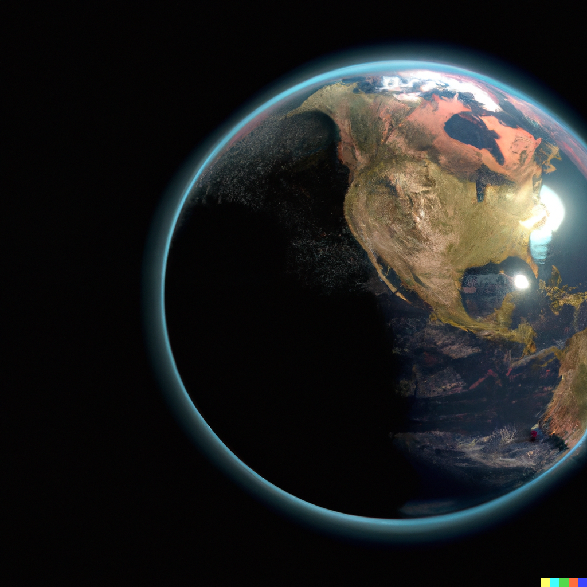

<h1>Global Defense</h1>

We need your help to defend our planet, commander.

Our global defense network targeting system has fallen, and there is no time for repairs, the enemy is already here.

Each of you will be assigned a part of the grid , and it is your task to tell us where to fire.

We're counting on you, cadets. May god help us all.

